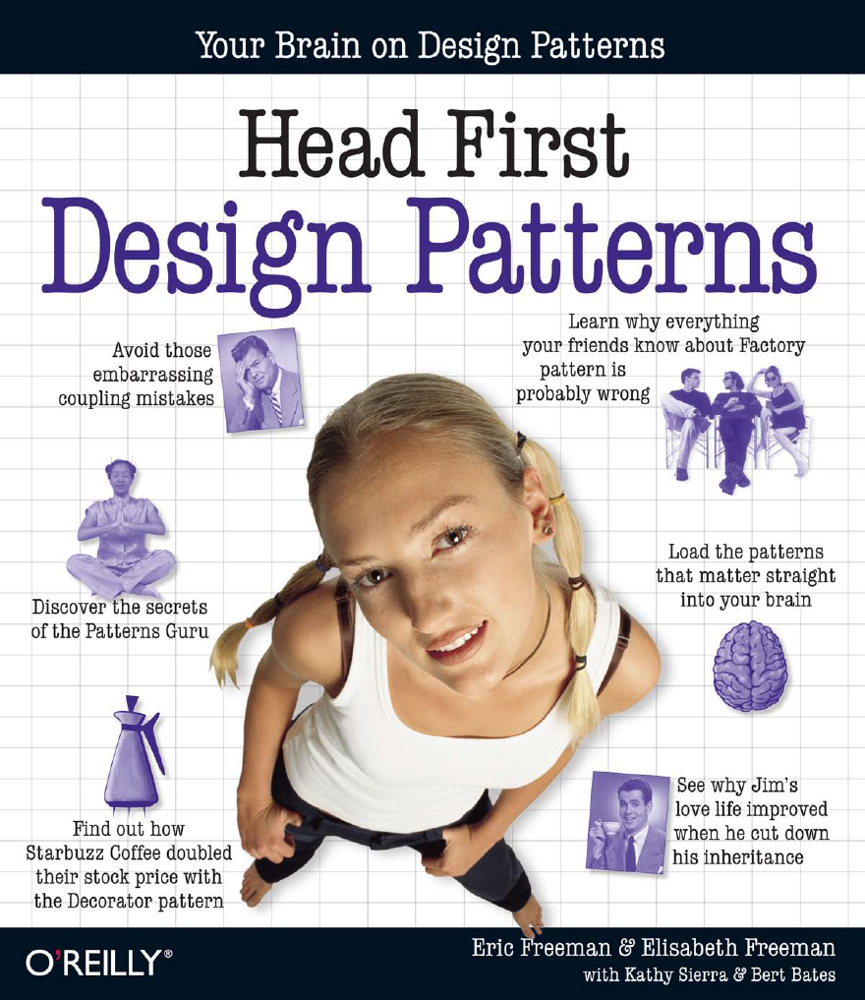
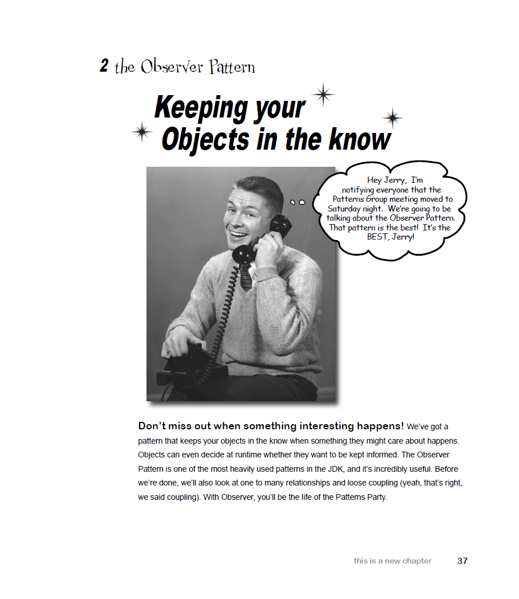
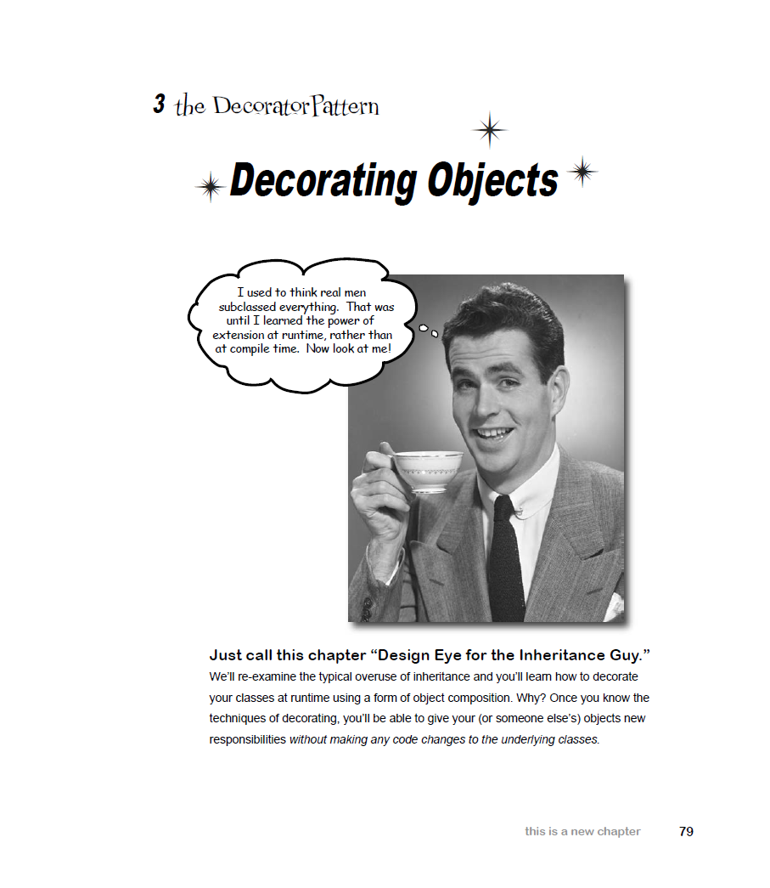

# Head First Design Patterns, First Edition
*Eric Freeman, Elisabeth Freeman, Kathy Sierra, Bert Bates (2004)*

---

## 📘 Chapter 1. Intro to Design Patterns: Welcome to Design Patterns

- 📂 Solutions are in folder: `com.headfirstdesignpatterns.chapter01`
- 📄 Exercises from the book:
    - Page 18–19 — Testing the Duck code
    - Page 20–21 — Setting behavior dynamically

---

## 📘 Chapter 2. The Observer Pattern: Keeping your Objects in the Know

- 📂 Solutions are in folder: `com.headfirstdesignpatterns.chapter02`
- 📄 Exercises from the book:
    - Page 57–60 — Implementing the Weather Station
    - Page 61 — Sharpen your pencil
    - Page 64–70 — Using Java's built-in Observer Pattern
    - Page 71–73 — The dark side of java.util.Observable

---

## 📘 Chapter 3. The Decorator Pattern: Decorating Objects

- 📂 Solutions are in folder: `com.headfirstdesignpatterns.chapter03`
- 📄 Exercises from the book:
    - Page 95–98 — Writing the Starbuzz code
    - Page 99 — Sharpen your pencil
    - Page 102–103 — Writing your own Java I/O Decorator

---

## 📘 Chapter 4. The Factory Pattern: Baking with OO Goodness

- 📂 Solutions are in folder: `com.headfirstdesignpatterns.chapter04`
- 📄 Exercises from the book:
    - Page 115–117 — Building a simple pizza factory

